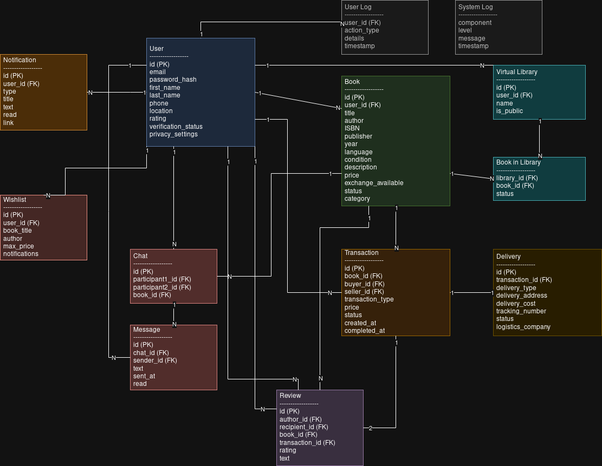

# Опис сутностей для "БукМаркет"

## Основні сутності

### 1. User
**Опис**: Зберігає інформацію про зареєстрованих користувачів платформи.

**Атрибути**:
- **id** *(Primary Key)*: Унікальний ідентифікатор користувача
- **email**: Електронна пошта для входу та комунікації
- **password_hash**: Захищене зберігання пароля
- **first_name**: Ім'я користувача
- **last_name**: Прізвище користувача
- **phone**: Контактний номер телефону
- **location**: Географічна локація користувача
- **rating**: Середній рейтинг користувача
- **verification_status**: Статус верифікації облікового запису
- **privacy_settings**: Налаштування видимості профілю

**Зв'язки**:
- Один користувач може мати багато книг, транзакцій, повідомлень, відгуків, бібліотек та сповіщень

### 2. Book
**Опис**: Зберігає інформацію про книги, доступні для продажу або обміну.

**Атрибути**:
- **id** *(Primary Key)*: Унікальний ідентифікатор книги
- **user_id** *(Foreign Key)*: Ідентифікатор власника книги
- **title**: Назва книги
- **author**: Автор(и) книги
- **ISBN**: Міжнародний стандартний номер книги
- **publisher**: Видавництво книги
- **year**: Рік видання
- **language**: Мова книги
- **condition**: Фізичний стан книги
- **description**: Опис книги від користувача
- **price**: Ціна книги
- **exchange_available**: Чи доступна книга для обміну
- **status**: Статус книги
- **category**: Категорія книги

**Зв'язки**:
- Книга належить одному користувачу
- Книга може мати зображення, бути частиною транзакцій та бібліотек

### 3. Transaction
**Опис**: Зберігає інформацію про транзакції продажу або обміну книг.

**Атрибути**:
- **id** *(Primary Key)*: Унікальний ідентифікатор транзакції
- **book_id** *(Foreign Key)*: Ідентифікатор книги в транзакції
- **buyer_id** *(Foreign Key)*: Ідентифікатор покупця
- **seller_id** *(Foreign Key)*: Ідентифікатор продавця
- **transaction_type**: Тип транзакції (продаж, обмін)
- **price**: Сума транзакції
- **status**: Статус транзакції
- **created_at**: Дата та час створення транзакції
- **completed_at**: Дата та час завершення транзакції

**Зв'язки**:
- Транзакція пов'язана з книгою, покупцем і продавцем
- Транзакція може мати доставку і відгуки

### 4. Delivery
**Опис**: Інформація про доставку книг.

**Атрибути**:
- **id** *(Primary Key)*: Унікальний ідентифікатор доставки
- **transaction_id** *(Foreign Key)*: Ідентифікатор транзакції
- **delivery_type**: Тип доставки
- **delivery_address**: Адреса для доставки
- **delivery_cost**: Вартість доставки
- **tracking_number**: Номер для відстеження
- **status**: Статус доставки
- **logistics_company**: Назва логістичної компанії

**Зв'язки**:
- Доставка належить одній транзакції

## Взаємодія користувачів

### 5. Chat та Message
**Опис**: Зберігає комунікацію між користувачами.

**Атрибути чату**:
- **id** *(Primary Key)*: Ідентифікатор чату
- **participant1_id** *(Foreign Key)*: Перший учасник
- **participant2_id** *(Foreign Key)*: Другий учасник
- **book_id** *(Foreign Key)*: Ідентифікатор книги (опціонально)

**Атрибути повідомлення**:
- **id** *(Primary Key)*: Ідентифікатор повідомлення
- **chat_id** *(Foreign Key)*: Ідентифікатор чату
- **sender_id** *(Foreign Key)*: Відправник повідомлення
- **text**: Текст повідомлення
- **sent_at**: Час відправлення
- **read**: Статус прочитання

**Зв'язки**:
- Чат об'єднує двох користувачів та може стосуватись книги
- Повідомлення належать до конкретного чату

### 6. Review
**Опис**: Відгуки про користувачів та книги.

**Атрибути**:
- **id** *(Primary Key)*: Ідентифікатор відгуку
- **author_id** *(Foreign Key)*: Автор відгуку
- **recipient_id** *(Foreign Key)*: Отримувач відгуку
- **book_id** *(Foreign Key)*: Книга відгуку (опціонально)
- **transaction_id** *(Foreign Key)*: Пов'язана транзакція
- **rating**: Числова оцінка (1-5)
- **text**: Текст відгуку

**Зв'язки**:
- Відгук має автора і може стосуватись книги або користувача

## Користувацький контент

### 7. Virtual Library
**Опис**: Колекції книг користувачів.

**Атрибути бібліотеки**:
- **id** *(Primary Key)*: Ідентифікатор бібліотеки
- **user_id** *(Foreign Key)*: Власник бібліотеки
- **name**: Назва бібліотеки
- **is_public**: Налаштування доступу

**Атрибути книги в бібліотеці**:
- **library_id** *(Foreign Key)*: Ідентифікатор бібліотеки
- **book_id** *(Foreign Key)*: Ідентифікатор книги
- **status**: Статус читання

**Зв'язки**:
- Бібліотека належить користувачу і містить книги

### 8. Wishlist
**Опис**: Книги, які користувач хотів би придбати.

**Атрибути**:
- **id** *(Primary Key)*: Ідентифікатор запису
- **user_id** *(Foreign Key)*: Власник запису
- **book_title**: Назва бажаної книги
- **author**: Автор бажаної книги
- **max_price**: Максимальна прийнятна ціна
- **notifications**: Налаштування сповіщень

**Зв'язки**:
- Список бажань належить користувачу

### 9. Notification
**Опис**: Сповіщення для користувачів.

**Атрибути**:
- **id** *(Primary Key)*: Ідентифікатор сповіщення
- **user_id** *(Foreign Key)*: Одержувач сповіщення
- **type**: Тип сповіщення
- **title**: Заголовок
- **text**: Текст сповіщення
- **read**: Статус прочитання
- **link**: Пов'язане посилання

**Зв'язки**:
- Сповіщення належить користувачу

## Технічні дані

### 10. Logging
**Опис**: Логи дій користувачів та системи.

**Атрибути логу користувача**:
- **user_id** *(Foreign Key)*: Користувач
- **action_type**: Тип виконаної дії
- **details**: Інформація про дію
- **timestamp**: Час виконання

**Атрибути системного логу**:
- **component**: Компонент системи
- **level**: Рівень важливості
- **message**: Текст повідомлення
- **timestamp**: Час запису

**Зв'язки**:
- Логи дій пов'язаний з користувачем 

Діаграма сутностей:

